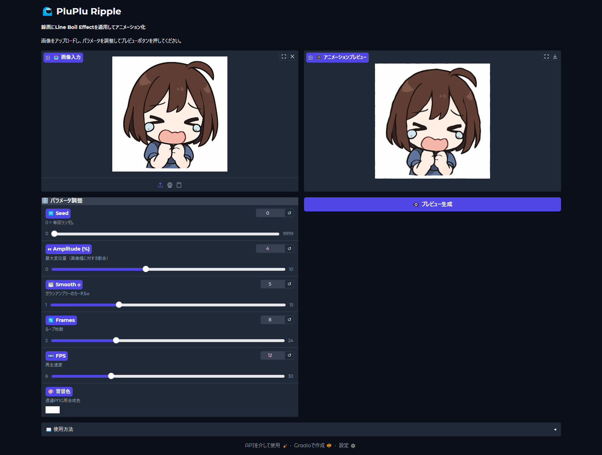

# 🌊 PluPlu Ripple

**線画にLine Boil Effectを適用してアニメーション化するツール**

[](https://python.org)
[](https://gradio.app)
[](https://opencv.org)

## 📖 概要

PluPlu Rippleは、既存の線画やイラストに**Line Boil Effect**（線の微細な揺れ効果）を適用して、ループするGIFアニメーションを生成するツールです。

手描きアニメーションでよく見られる「線の生き生きとした揺れ」を、既存の静止画に簡単に追加できます。

## 📸 プレビュー

### アプリ画面


### 出力サンプル


## ✨ 特徴

- 🎨 **簡単操作**: ドラッグ&ドロップで画像をアップロード
- ⚡ **リアルタイムプレビュー**: パラメータ調整後すぐに結果を確認
- 🎛️ **細かい調整**: 振幅、滑らかさ、フレーム数、FPSを自由に設定
- 🌈 **透過対応**: アルファチャンネル付きPNGに完全対応
- 🔄 **再現可能**: Seed値指定で同じ揺れパターンを再現
- 🌐 **Web UI**: ブラウザで動作する直感的なインターフェース

## 🚀 クイックスタート

### 必要環境
- Python 3.12以上
- pip

### インストール & 実行

```bash
# リポジトリをクローン(git clone)後
# 依存関係をインストール(要 uv, python 3.12+)
uv sync

# アプリケーションを起動
python app.py
```

ブラウザで `http://localhost:7860` にアクセスしてご利用ください。

## 🎛️ パラメータ説明

| パラメータ | 範囲 | デフォルト | 説明 |
|-----------|-----|----------|------|
| **🔀 Seed** | 0-9999 | 0 | 乱数シード（0=毎回ランダム） |
| **↔ Amplitude (%)** | 0-10 | 3 | 最大変位量（揺れの強さを画像幅に対する割合で指定） |
| **🌫️ Smooth σ** | 1-15 | 5 | ガウシアンブラーσ（揺れの滑らかさ） |
| **🔄 Frames** | 2-24 | 8 | ループフレーム数 |
| **🎞️ FPS** | 6-30 | 16 | 再生フレームレート |
| **🎨 背景色** | カラーピッカー | #FFFFFF | 透過部分の背景色 |

### 推奨設定

**自然な線画の揺れ**:
- Amplitude: 1.0-2.0px
- Smooth σ: 5-8
- Frames: 8-12
- FPS: 12-16

**強めのエフェクト**:
- Amplitude: 2.5-4.0px  
- Smooth σ: 3-6
- Frames: 12-16
- FPS: 16-20

## 🎯 使用方法

1. **画像をアップロード**
   - PNG、JPEG形式に対応
   - 透過PNGがおすすめ（背景色指定可能）

2. **パラメータを調整**
   - スライダーで各値を調整
   - リアルタイムで効果を確認

3. **プレビュー生成**
   - 「👁️‍🗨️ プレビュー生成」ボタンをクリック
   - アニメーションGIFが生成されます

4. **結果をダウンロード**
   - 生成されたGIFをダウンロードボタンをクリックして保存

## 🔬 技術詳細

### アルゴリズム
1. **ノイズ生成**: フレームごとに2Dランダムノイズを生成
2. **平滑化**: ガウシアンブラーで自然な変位マップを作成
3. **リマッピング**: OpenCVの`cv2.remap()`でサブピクセル精度の変位を適用
4. **GIF出力**: PIL/Pillowでループアニメーションを生成

### 主要技術スタック
- **[Gradio](https://gradio.app)**: Web UIフレームワーク
- **[OpenCV](https://opencv.org)**: 画像処理・リマッピング
- **[NumPy](https://numpy.org)**: 数値計算・配列操作
- **[Pillow (PIL)](https://pillow.readthedocs.io)**: 画像フォーマット・GIF生成

## 📁 プロジェクト構成

```
pluplu-ripple/
├── app.py              # Gradio Webアプリケーション
├── core.py             # Line Boil Effectコアアルゴリズム
├── pyproject.toml      # プロジェクト設定・依存関係
├── spec.md             # 技術仕様書
├── README.md           # このファイル
└── uv.lock             # 依存関係ロックファイル
```

## 💡 使用例・Tips

### 最適な素材
- **線画**: シンプルな線で描かれたイラスト
- **モノクロイラスト**: 白背景に黒線のイラスト
- **透過PNG**: 背景が透明な素材

### エフェクトのコツ
- **控えめな設定**: Amplitude 1.0-1.5pxで自然な印象
- **フレーム数**: 8-12フレームが軽量で効果的
- **FPS調整**: 12-16fpsが手描きアニメらしさを演出

## 📄 ライセンス

このプロジェクトはMITライセンスの下で公開されています。

## 🙏 謝辞

- **Line Boil Effect**: 手描きアニメーションの伝統的技法
- **OpenCV**: 高性能画像処理ライブラリ
- **Gradio**: 簡単なWeb UIフレームワーク

---

**PluPlu Ripple** - あなたの線画に生命を吹き込みます 🌊✨
